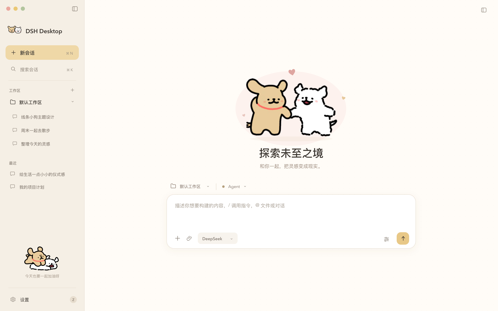

# 线条小狗 · 贴贴日常

DeepSeek Harness / DSH Desktop 的情侣主题：**陈瓜瓜 × 陈西西**。奶油白背景、淡粉选中状态、奶黄色按钮，欢迎页牵手、侧边栏贴贴，设置页展示双小狗拥抱。



## 使用

在插件页添加本目录：

```text
/Users/zhy/dsh-line-puppy-theme
```

已安装旧版时，当前 DSH 插件页要求先卸载再安装。源码会复制到 profile 的 generation；源码改动不会直接改变已安装副本。安装新版后重新加载客户端。

**设置 → 线条小狗** 可即时切换：

| 选项 | 效果 |
| --- | --- |
| 启用情侣主题 | 配色总开关，关闭后恢复宿主外观 |
| 侧边栏双小狗 | 双头像、品牌标记和底部双小狗举爪加油表情；收起侧边栏时隐藏底部装饰 |
| 欢迎页贴贴插画 | 欢迎页双小狗；关闭后恢复原生欢迎区 |
| 轻柔纸纹 | 内容区极淡点阵 |
| 轻微动效 | 小狗缓慢起伏、爱心渐变；遵循系统减少动态效果设置 |
| 点缀色 | 奶油黄 / 樱花粉 / 鼠尾草绿 |

偏好由 DSH Config 保存，无浏览器存储。旧版暖黄、淡粉、薄荷会自动对应新配色。关闭总开关后设置页仍可操作。

## 实现

- 插画为打包的静态 PNG，运行时内嵌，不请求远程资源，也不循环解码动画。
- 通过独立根属性与 CSS 覆盖 alias 令牌，不修改宿主明暗属性或内联配色；避免旧版相互对抗的 MutationObserver 导致卡死。
- 品牌单插槽使用独立优先级；关闭对应开关时注销替换，原生标记立即恢复。
- 欢迎区使用 CSS-module 名称后缀适配当前 DSH 布局；窗口变矮时缩小插画，输入框、工作区和权限控件继续由宿主管理。
- 当前预览为设计稿，原生控件和设置容器由实际 DSH 版本决定。

## 开发与验证

```bash
node scripts/build.mjs
node tests/smoke.mjs
```

构建脚本将本地插画编码到客户端包并拼接源文件，不依赖打包器。回归覆盖主题启停、旧配色迁移、插槽恢复、收起侧边栏、离线插画与宿主配色不被改写。

```bash
LP_KEEP_OUT=1 node tests/smoke.mjs
node tests/render-settings-preview.mjs
```

第二个命令从实际设置组件树生成 HTML，供检查真实组件和 CSS。

## 文件

- `src/client/data.js`：令牌与设置默认值。
- `src/client/art.js`：双头像与情侣插画 SVG 容器。
- `src/client/styles.js`：欢迎页、侧边栏、设置页样式。
- `src/client/mascot.js`：React 组件。
- `src/client/settings.js`：持久化设置控制器。
- `src/client/index.js`：样式和插槽生命周期。
- `src/index.js`：宿主 Config schema。
- `static/art/`：本地插画快照与资源来源。

## 更新

1.1.0：实现情侣主题、三种点缀色、欢迎区牵手插画、侧边栏双小狗举爪加油表情和新的设置页；保留 1.0.1 的卡死与插槽冲突修复。左上角双头像已改用官方迷你头像素材，保留角色原本的线条与表情。

代码采用 MIT。角色与插画来源、权利归属见 [NOTICE.md](NOTICE.md)。
